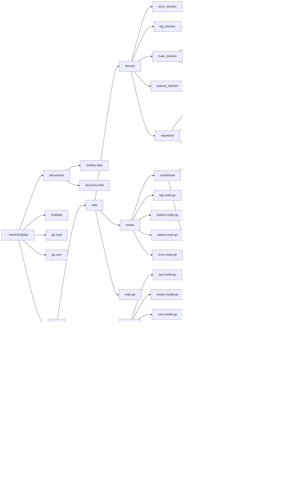

# GoBaby App

GoBaby is a Go application designed to help parents track feeding times for newborn babies. The application utilizes Clean Architecture principles to ensure separation of concerns, maintainability, and testability.

## Main Features

- _Countdown Timer_: The app starts a countdown timer set to 4 hours, simulating the interval between feedings for a newborn baby.
- _Reset Button_: Users can reset the countdown timer with a button click. When the timer is reset, the app logs the reset time along with the date.
- _Logging_: The application logs each feeding time, including the time at which the feeding occurred and the date.
- _Log Viewer_: Users can view a log of all feeding times in a table format.

## Folder Structure

The folder structure follows Clean Architecture principles, separating concerns into layers:

- _cmd_: Contains the main application entry point (main.go) and related documents.
- _internal_: Houses the core business logic of the application.
  - _models_: Defines data models such as logs and routes.
  - _utils_: Provides utility functions like API helpers and clock utilities.
- _web_: Implements the web interface and handles HTTP requests.
  - _domain_: Contains domain-specific logic.
    - _error_: Handles error handling functionality, including rendering error templates.
    - _log_: Handles logging functionality.
    - _main_: Manages the main application logic, including the countdown timer.
    - _options_: Handles application options and configurations.
    - _repository_: Implements data access logic using adapters and configurations.
  - _routes_: Defines HTTP routes for different functionalities.
- _ui_: Contains HTML templates and static assets for the user interface.
  - _html_: Houses HTML pages for different parts of the application.
    - _pages_: Includes pages for logs, main functionality, options, and error handling.
  - _static_: Stores CSS stylesheets and other static assets.

## Clean Architecture

GoBaby follows Clean Architecture principles to achieve a modular and maintainable codebase. The application is structured in layers, with dependencies flowing inward toward the core business logic. This architecture allows for easy testing, scalability, and flexibility in adapting to future requirements.

## Installation and Usage

To run the application, ensure you have Go installed on your machine. Clone the repository and navigate to the cmd/web directory. Run the main.go file to start the application. Access the application through a web browser at the specified port.

## Contributing

Contributions to GoBaby are welcome! Feel free to submit bug reports, feature requests, or pull requests through GitHub.

## Organizing Files Based on Logic

To maintain a structured and organized codebase, it's essential to follow a consistent approach when adding new files. This section outlines guidelines for organizing files based on the type of logic they represent within the application.

### Domain Logic

Domain logic represents the core business rules and operations of the application. When adding files related to domain logic, follow these guidelines:

- _Folder_: Place domain logic files under the web/domain directory.
- _Naming_: Use descriptive names for files and directories that reflect the specific domain aspect they address (e.g., log, main, options).
- _Responsibilities_: Each domain module should encapsulate related functionality, such as handling logs, managing main application logic, or dealing with application options.

### Data Access Logic

Data access logic handles interactions with databases, external APIs, or other data sources. Follow these guidelines when adding files related to data access:

- _Folder_: Place data access logic files under the web/domain/repository directory.
- _Adapters_: Use the adapters directory to store data access adapters, which encapsulate interactions with external data sources.
- _Configurations_: Store database configurations and other data access configurations under the config directory.
- _Responsibilities_: Separate data access logic based on the type of data source or functionality it addresses.

### User Interface Logic

User interface logic manages the presentation layer of the application, including HTML templates, CSS stylesheets, and static assets. Here's how to organize UI-related files:

- _Folder_: Place UI-related files under

the ui directory.

- _HTML Templates_: Store HTML templates under the html/pages directory, organized by different application views (e.g., logs, main, options).
- _Static Assets_: Store CSS stylesheets and other static assets under the static/css directory.

### Internal Logic and Utilities

Internal logic and utility functions support the overall operation of the application but are not directly tied to domain-specific or user interface logic. Follow these guidelines for organizing internal logic and utilities:

- _Folder_: Place internal logic and utility files under the internal directory.
- _Models_: Define data models and structures under the internal/models directory.
- _Utilities_: Store utility functions, such as API helpers and clock utilities, under the internal/utils directory.

By following these guidelines, developers can ensure a consistent and structured approach to organizing files within the GoBaby application, promoting clarity, maintainability, and collaboration across the development team.

## Managing Errors

Proper error handling is crucial for maintaining a robust and reliable application. GoBaby adopts a centralized error management approach to ensure consistent error handling throughout the application. Here's how error management is implemented:

### Error Domain

The errorDomain package contains functionality related to error handling, including rendering error templates. Error-related logic is encapsulated within this domain to keep the code organized and maintainable.

### Error Rendering

The ErrorTemplate function in the errorDomain package is responsible for rendering error templates. When an error occurs, this function is called to display the appropriate error message to the user.

### Error Models

The AppError struct in the models package defines the structure of application errors. Each error includes a message, code, and underlying error, providing comprehensive information for debugging and troubleshooting.

### Error Codes

GoBaby defines custom error codes to categorize different types of errors that may occur within the application. These codes help developers identify the nature of the error and take appropriate action to resolve it.

### Error Handling in Application Logic

Throughout the application logic, errors are handled using the AppError struct and associated error codes. When an error occurs, it is wrapped in an AppError instance and returned to the caller, ensuring consistent error propagation.

By following these error management practices, GoBaby maintains a reliable and user-friendly error handling system, enhancing the overall robustness and usability of the application.
